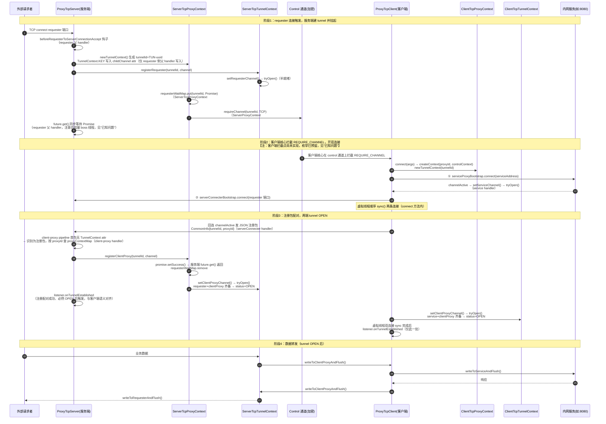

# TCP 通道建立流程

> 一条 TCP 隧道 = 外部 requester 的一条连接 + 客户端回连服务端的一条连接 + 客户端连内网服务的一条连接，由同一个 `ServerTcpTunnelContext` / `ClientTcpTunnelContext` 配对管理。通道建立过程中与 control 的交互**全部经 ProxyContext 体系实现**，引导类不直接触碰 control 通道。相关文档：[control 建立流程](./control建立流程.md)、[UDP 通道建立流程](./UDP通道建立流程.md)。
>
> 本文引用一律使用符号名（类名 / 方法名），不写行号。

## 1. 前提

- control 通道已完成握手（双方各自持有 `ControlContext`，`permit=true`）；
- 服务端已启动 `ProxyTcpServer`，其两类监听的拓扑为：
  - **ClientProxyServer（client-proxy 端口，默认 3418）仅有一个，所有客户端共享**——所有客户端的回连都进入这同一个监听；
  - **RequesterProxyServer（requester 端口，`bind(0)`）与 ProxyContext 一一对应**——每个客户端申请的 proxyContext 各有一个专属的 requester 监听，服务该 proxyContext 下的所有隧道；
- 客户端侧持有 `ProxyClientConnectArgs{tunnelId, proxyId, serviceAddress, controlContext}`。

## 2. 建立流程时序图



## 3. 关键点逐条说明

| # | 关键点 | 调用/数据流经 | 实现了什么 |
|---|---|---|---|
| 1 | tunnel 创建 | `ProxyContext#newTunnelContext(tunnelId)` 创建 `ServerTcpTunnelContext` 并自动挂 `tunnelCloseHook`（出 map）与 `closeRemoteTunnelHook`（发 TUNNEL_CLOSE）入 `tunnelRegisterMap` | 隧道生命周期钩子在创建时就绑定好，后续关闭路径无需再编排 |
| 2 | control 交互收敛点 | `ServerTcpProxyContext#registerRequester` → `ServerProxyContext#requireChannel` → `ProxyContext#controlClient` → `ControlContext#writeAndFlush`（自动附加 msgId） | 服务端请求客户端开通道；**引导类 ProxyTcpServer 不触碰 control 通道**，只持有返回的 Promise |
| 3 | 挂起-唤醒机制 | `requesterWaitMap`（`ServerProxyContext` 字段）持有 Promise；唤醒由**数据面**注册包触发的 `registerClientProxy()` 完成 | 经 control 通道发出的异步请求，由 proxy 数据通道上的注册包闭环——控制面发起、数据面应答 |
| 4 | 双连接顺序 | 虚拟线程先 `serviceProxyBootstrap.connect().sync()` 再 `serverConnecterBootstrap.connect().sync()`（`ProxyTcpClient#connect` 内） | 保证回连注册包发出时内网服务侧已就绪，`tryOpen()` 时两 channel 不会长时间半开 |
| 5 | 注册包配对 | 客户端回连 `channelActive` 即发 JSON `CommonInfo{tunnelId, proxyId}`；服务端 client-proxy pipeline 以「childChannel 无 `TunnelContext.KEY` attr」识别注册包，按 proxyId 从 `proxyContextMap` 定位上下文并绑定 attr | 回连连接与挂起的 tunnel 配对；此后该连接 attr 齐备，纯转发。**attr 写入只发生在两处：requester 侧父 handler（建隧道时）与 client-proxy 侧注册配对成功后** |
| 6 | tryOpen 状态机 | `ServerTcpTunnelContext.tryOpen()`：requester + clientProxy 双 channel 非空 → OPEN；`ClientTcpTunnelContext.tryOpen()`：service + clientProxy → OPEN；`setXxxChannel()` 内部在首次赋值后自动调 `tryOpen()` | OPEN 判定内聚在 TunnelContext，两端独立判定；转发方法 `writeToXxxAndFlush` 仅在 OPEN 时 `msg.retain()` 转发，杜绝半开隧道漏数据 |
| 7 | 连接复用规则 | TCP 每个 requester 连接 = 一条完整隧道（客户端新建两条连接）；`ClientTcpProxyContext`/`ServerTcpProxyContext`（proxyId）跨隧道复用（`computeIfAbsent`，见 `ProxyTcpClient#createContext`）；监听拓扑上 **ClientProxyServer 全局一个共享，RequesterProxyServer 按 proxyContext 一一对应** | 隧道间互不影响；不同客户端的隧道在 client-proxy 共享入口靠注册包（proxyId）分拣，在各自的 requester 端口天然隔离 |
| 8 | 转发四段链 | requester → `writeToClientProxy` → clientProxy(服务端) → clientProxy(客户端) → `writeToService` → 内网服务，响应原路反向 | 数据全程为裸 ByteBuf 明文，无编解码/加密 handler；有序可靠由 TCP 自身保证 |
| 9 | 级联关闭 | 触发点仅两处：服务端 requester channelInactive 与客户端 service channelInactive → `TunnelContext.closeGracefully()`：`tunnelCloseHook`（本地出 map）+ `closeRemoteTunnelHook`（经 `ProxyContext#closeRemoteTunnel` 发 `TUNNEL_CLOSE`）+ 双 channel close。**注意：服务端 client-proxy 回连断开与客户端 serverConnecter 断开目前仅打日志，不级联关闭** | requester 断或内网服务断时级联通知对端并释放全部资源；中继段（client-proxy）断开暂无级联 |
| 10 | proxy 级关闭 | `ProxyContext#close()`：closeProxyHook（出 proxyContextMap）→ `closeRemoteProxy()` 发 `PROXY_CLOSE` → 逐 tunnel `closeGracefully` → 逐 channel close | 整个代理下线时隧道与对端通知的编排仍内聚在 ProxyContext |
| 11 | onTunnelEstablished 语义 | 服务端：client-proxy 注册包配对成功后触发（`ProxyTcpServer` client-proxy handler 内）；客户端：虚拟线程两条连接均 sync 成功后触发（`ProxyTcpClient#connect` 末尾，单次） | 两端语义已对齐为「**配对成功、tunnel 必然 OPEN**」；requester 子连接 channelActive 处不再回调 |

## 4. 一图总结数据面与控制面

```
控制面（加密，慢速，少量事件）:
  ServerTcpProxyContext ──REQUIRE_CHANNEL──▶ Control 通道 ──▶ 客户端核心拦截 ──▶ ProxyTcpClient

数据面（明文，高速，纯字节流）:
  外部requester ⇄ [ServerTcpTunnelContext: requesterChannel⇄clientProxyChannel]
                ⇄ [ClientTcpTunnelContext: clientProxyChannel⇄serviceChannel] ⇄ 内网服务

闭环方式: 控制面发出请求（Promise挂起）→ 数据面注册包（CommonInfo{tunnelId,proxyId}）配对 → Promise唤醒 → 双端 tryOpen → OPEN → 数据流通
```

## 5. 已知问题

- **客户端拦截 `REQUIRE_CHANNEL` 尚未实现**：`ControlClient` 业务 handler 对 permit 后的非 PONG 事件一律委托 `controlClientListener.onEvent`，库内无拦截代码。`ProxyControlEventEnum` 枚举已预留，原计划经 listener 的 `addEventHandler` handler 实现；本文时序图中的"客户端核心拦截"为目标设计。
- **级联关闭覆盖不全**：仅 requester（服务端）与 service（客户端）两端的 channelInactive 触发 `closeGracefully`；client-proxy 中继段两端断开仅记日志（见关键点 #9）。
- **TCP 注册包无粘包处理**：client-proxy handler 一次性 `readString` 假设整包到达。
- **requester 父 handler 阻塞 boss 线程**：`ProxyTcpServer` requester 侧 `future.get()` 同步等待注册回连，等待期间无法 accept 新连接。
- **客户端 `onTunnelEstablished` 双触发已修复（仅 TCP）**：原 serverConnecter `channelActive` 与虚拟线程双连接完成后各调一次；已删除前者，保留后者——语义为"两条连接均 sync 成功、tunnel 必然 OPEN"。**UDP 侧仍在 `ProxyUdpClient` 的 channelActive 与 `connect()` 末尾各回调一次，尚未收敛**（见 UDP 文档"已知问题"）。
