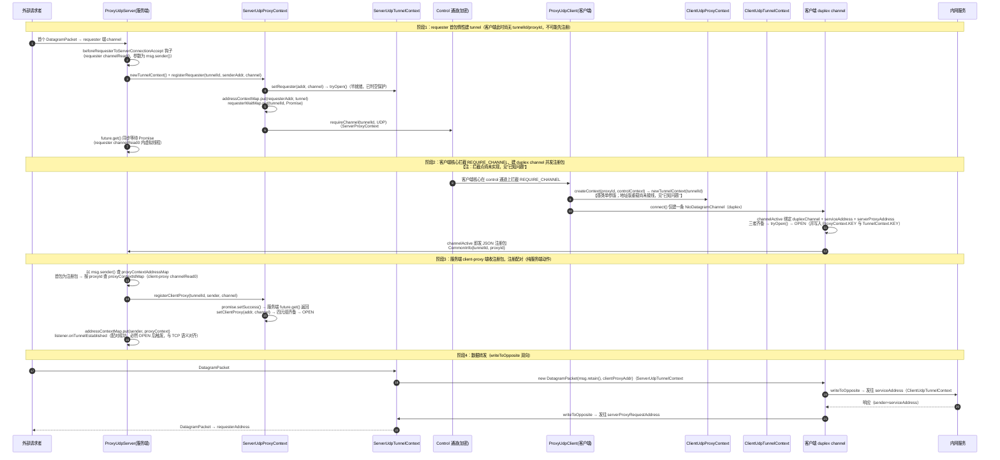

# UDP 通道建立流程

> UDP 无连接，没有 TCP 那样的"连接建立"事件，整个通道建立围绕**「首包即注册」与「地址 → tunnel」映射**展开。客户端只用一条 duplex channel，服务端两条 channel（client-proxy 端 / requester 端）均多连接复用，靠 `InetSocketAddress` 区分对端。与 control 的交互同样**全部经 ProxyContext 体系实现**。相关文档：[control 建立流程](./control建立流程.md)、[TCP 通道建立流程](./TCP通道建立流程.md)。
>
> 本文引用一律使用符号名（类名 / 方法名），不写行号。

## 1. 前提

- control 通道已握手完成；
- 服务端已启动 `ProxyUdpServer`，其两类监听的拓扑为：
  - **ClientProxyServer（client-proxy 端）仅有一条 `NioDatagramChannel`，所有客户端共享**——所有客户端的注册与隧道流量都进入这同一个监听；
  - **RequesterProxyServer（requester 端，`bind(0)`）与 ProxyContext 一一对应**——每个客户端申请的 proxyContext 各有一条专属的 requester channel，服务该 proxyContext 下的所有隧道；
- 客户端持有 `ProxyClientConnectArgs{tunnelId, proxyId, serviceAddress, controlContext}`。

## 2. 建立流程时序图



## 3. 与 TCP 建立流程的差异

| 维度 | TCP | UDP |
|---|---|---|
| tunnel 触发时机 | requester **连接建立**即触发（channelActive/父 handler channelRead） | requester **首个数据包**才惰性触发（requester `channelRead0`）——UDP 无连接事件 |
| 客户端连接数 | 每隧道两条新 TCP 连接 | 全局**一条 duplex channel** 复用，既连内网服务又通服务器——UDP 是包协议，一个 Channel 即可完成分发，无需严格一条 Tunnel 一个连接 |
| 注册方式 | 回连后 `channelActive` 发注册包 | duplex channel `channelActive` 即发注册包 |
| 对端区分 | 每隧道独立 channel，attr（`ProxyContext.KEY`/`TunnelContext.KEY`）直接绑定 | 包协议下每包自带来源地址，**分发靠地址 map**：服务端 `addressContextMap`（`ServerUdpProxyContext` 字段）按 sender 查 tunnel 路由；客户端 `addressContextMap`（`ClientUdpProxyContext` 字段）为**目标设计、尚未接线**（见"已知问题"），客户端实际靠 `msg.sender()` 与 `serviceAddress` 比对判向 |
| 配对资源 | clientProxy 是新 Channel | registerClientProxy 记录的是**地址 + 同一条 channel**（`setClientProxy(addr, channel)`） |
| OPEN 判定 | 两 channel 非空 | 客户端：duplexChannel + serviceAddress + serverProxyAddress 三要素（`ClientUdpTunnelContext.tryOpen`）；服务端：requester 与 clientProxy 的 channel/address 四元组（`ServerUdpTunnelContext.tryOpen`） |
| 转发写法 | `channel.writeAndFlush(msg.retain())` | `new DatagramPacket(msg.retain(), targetAddress)` 写回同一 channel |
| 超时管理 | TCP 断连即 channelInactive 级联 | 无断连事件 → 客户端 tunnel 30s 无活动 `checkTimeout()`；服务端 `ServerUdpProxyContext` 内置 **10s 周期定时器**扫描各 tunnel，`close()` 时取消 |

## 4. 关键点逐条说明

| # | 关键点 | 调用/数据流经 | 实现了什么 |
|---|---|---|---|
| 1 | 单 duplex channel | `ProxyUdpClient.connect()` 只 bind 一条 `NioDatagramChannel` | UDP 是包协议，每包自带来源/目标地址，一个 Channel 即可完成分发，无需像 TCP 那样严格一条 Tunnel 一个连接；channel 同时承担「连服务器」与「连内网服务」两个方向，方向由 `msg.sender()` 判别 |
| 2 | 主动注册 | duplex `channelActive` 直接向服务端发 JSON `CommonInfo{tunnelId, proxyId}` | UDP 无握手，注册包兼作"连接建立"语义；服务端首包即识别客户端 |
| 3 | 地址分发 | 服务端 ClientProxyServer 以 `proxyContextAddressMap` 识别客户端；服务端 tunnel 级 `addressContextMap`（requester/clientProxy 地址 → tunnel）按包路由；**客户端侧 `addressContextMap` 为目标设计、尚未接线**（`ProxyUdpClient` 调基类单参 `newTunnelContext(String)`，地址表永不填充） | 无连接协议下的"会话"重建：每个 `InetSocketAddress` 视作一条逻辑隧道端点，map 即分发路由表 |
| 4 | 惰性建 tunnel | requester 端首包到达才 `newTunnelContext()` + `registerRequester()` | 没有外部流量就不占用隧道资源；requester channel（`bind(0)`）专属其 proxyContext，服务该 proxyContext 的所有 requester |
| 5 | control 交互收敛点 | `ServerUdpProxyContext#registerRequester`（已对 `tunnelRegisterMap.get(tunnelId)` 判空，未知 tunnelId 不再 NPE）→ `ServerProxyContext#requireChannel(tunnelId, UDP)` → `ProxyContext#controlClient` → `ControlContext#writeAndFlush` | 与 TCP 完全同构：引导类不触碰 control 通道，控制面发起、数据面闭环（Promise 由 registerClientProxy 完成） |
| 6 | tryOpen 多元组判定 | `ServerUdpTunnelContext.tryOpen()`：requester 的 channel+address 与 clientProxy 的 channel+address 四者齐备 → OPEN；`ClientUdpTunnelContext.tryOpen()`：duplexChannel + serviceAddress + serverProxyAddress 三者齐备 | OPEN 判定内聚 TunnelContext，`writeToOpposite` 仅 OPEN 时转发 |
| 7 | 超时替代断连 | 客户端 tunnel 30s `checkTimeout()` → `closeGracefully`；服务端 10s 周期定时器扫描（运行在 `DefaultEventLoopGroup` 共享线程组上） | UDP 感知不到对端消失，用双层超时（tunnel 级 30s + proxy 级 10s 扫描）兜底资源回收 |
| 8 | 地址级清理 | `ServerUdpProxyContext#tunnelCloseHook` 覆写版：除出 `tunnelRegisterMap` 外，还按 clientProxyAddress/requesterAddress 清 `addressContextMap`（客户端侧 `ClientUdpProxyContext#tunnelCloseHook` 同理） | 隧道关闭后地址映射不残留，同地址可再次建隧道 |
| 9 | 级联关闭 | `closeGracefully()` → `closeRemoteTunnelHook` → `ProxyContext#closeRemoteTunnel` 发 `TUNNEL_CLOSE`（与 TCP 共用同一 ProxyContext 路径）；duplex channel 断开时 `channelInactive`/`exceptionCaught` 按 `TunnelContext.KEY` 取隧道收尾（该 attr 已补挂） | 超时/主动关闭同样通知对端，两端隧道同步释放 |
| 10 | onTunnelEstablished 语义 | 服务端：`registerClientProxy` 配对成功、四元组齐备（OPEN）后触发（client-proxy `channelRead0` 内，单次）；客户端：channelActive 与 `connect()` 末尾**各一次**（待收敛） | 服务端与 TCP 语义对齐为「配对成功、必然 OPEN」；客户端 UDP 侧仍双触发 |

## 5. 一图总结数据面与控制面

```
控制面（加密，与 TCP 同构）:
  ServerUdpProxyContext ──REQUIRE_CHANNEL(tunnelId, UDP)──▶ Control 通道 ──▶ 客户端核心拦截 ──▶ ProxyUdpClient

数据面（明文，地址复用单 channel）:
  外部requester ─[DatagramPacket→requesterAddr]─▶ 服务端requester channel
      ⇄ [ServerUdpTunnelContext: 四元组寻址] ⇄
  客户端 duplex channel ─writeToOpposite按sender判向─▶ 内网服务

闭环方式: 首包惰性建tunnel → requireChannel挂Promise → 客户端duplex注册/数据面流量配对 → Promise唤醒 → 四元组齐 → OPEN → writeToOpposite双向流通
```

## 6. 已知问题

- **客户端拦截 `REQUIRE_CHANNEL` 尚未实现**：与 TCP 相同，`ControlClient` 目前把 permit 后的非 PONG 事件委托给 listener；`ProxyControlEventEnum` 枚举已预留，原计划经 listener 的 `addEventHandler` handler 实现，本文时序图为目标设计。
- **客户端 `addressContextMap` 未接线（目标设计，尚未接线）**：`ClientUdpProxyContext` 有地址版 `newTunnelContext(tunnelId, address)` 重载（已补挂 `tunnelCloseHook` 与 `closeRemoteTunnelHook` 双钩子，并预登记地址），但 `ProxyUdpClient.connect()` 实际调用的是**基类单参** `newTunnelContext(String)`，`addressContextMap` 永不填充 → `getTunnelContext(sender)` 恒为 null。正文 §3/§4 中客户端地址分发的描述保留为目标设计，均以此注为准；当前客户端实际按 `msg.sender()` 与预期地址比对判向。
- **UDP 客户端 `onTunnelEstablished` 双触发（待修）**：`ProxyUdpClient` 在 duplex channel 的 `channelActive` 与 `connect()` 末尾（虚拟线程中 bind 成功后）各回调一次；TCP 侧同类问题已修复（保留单次），UDP 尚未收敛。
- **注册失败无客户端感知**：TCP 注册失败会 `ctx.close()`；UDP 注册失败时服务端已**回滚会话表（`proxyContextAddressMap.remove`）并 return**（不再 NPE/脏路由），但仍仅打日志、不回应错误包，客户端无失败感知。
- **共享 channel 异常即整体关闭**：两条共享 channel 的 `exceptionCaught` 直接 `ctx.close()`，任一客户端的异常会中断该 channel 上所有客户端。
- **`requesterTimeout` 的 `IdleStateHandler` 已注释**：requester 端 pipeline 原有的 `IdleStateHandler(0,0,requesterTimeout)` 因无 `IdleEventHandler` 消费超时事件而无效，已在代码中注释掉；UDP 资源回收依赖两层超时（客户端 tunnel 30s `checkTimeout` + 服务端 `ServerUdpProxyContext` 10s 周期扫描）。

已在本轮修复（留档）：`ServerUdpTunnelContext` setter 条件笔误（原 `if (clientProxyAddress == null)` 漏 `this.` 导致永不 OPEN）；`ServerUdpProxyContext.registerRequester` 补判空；`ProxyUdpProxyContext`（`ClientUdpProxyContext`）地址版重载补挂 `closeRemoteTunnelHook`；`ProxyUdpServer` 注册失败回滚会话表并 return；`ProxyUdpClient.channelActive` 补挂 `TunnelContext.KEY`；服务端 `onTunnelEstablished` 移到注册配对成功后触发。
