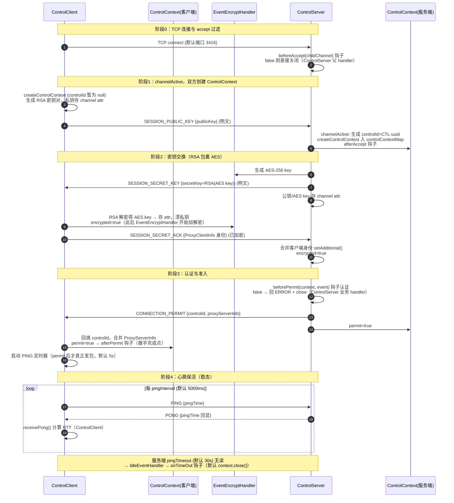

# Control 通道建立流程

> 控制通道是整个内网穿透的控制面：握手认证、心跳保活、隧道调度事件（REQUIRE_CHANNEL / TUNNEL_CLOSE / PROXY_CLOSE）都在这条加密通道上传递。本文聚焦**通道本身如何建立**。相关文档：[TCP 通道建立流程](./TCP通道建立流程.md)、[UDP 通道建立流程](./UDP通道建立流程.md)。

## 1. 前置：服务端信息获取（可选，UDP 仅作备选）

客户端在连接 control 之前需要拿到服务端的三地址元数据（control / proxyRequest / infoServer），但**获取方式不限于 UDP 发现**：

- **UDP 发现（备选）**：服务端启动 `ServerInfoServer`（UDP 3461），客户端经 `ProxyServerInfo#getMetaDataFromServerInfoServer()` 用原生 DatagramSocket 发 `SERVER_INFO` 查询，服务端在 `ServerInfoServer#channelRead0` 单播回 JSON 应答：
  ```
  客户端                                        服务端
    │ ── SERVER_INFO 查询（DatagramSocket）──▶ │ ServerInfoServer（UDP 3461）
    │ ◀── ProxyServerInfo JSON 应答 ────────── │
    │                                          │
    解析出 control 地址 → 发起 TCP 连接           │
  ```
- **其他途径（规划中）**：服务端信息未来还会通过 HTTP 端点、社交媒体等渠道暴露；当前项目**没有实际代码调用** UDP 发现流程，它仅作为备选手段保留。

无论元数据从哪个渠道获得，后续 control 通道的建立流程完全一致。

## 2. 建立流程总览（时序图）



## 3. 关键点逐条说明（谁调用、数据流经哪个类、实现了什么）

| # | 关键点 | 调用/数据流经 | 实现了什么 |
|---|---|---|---|
| 1 | accept 过滤 | 父 channel handler → `ControlServerListener.beforeAccept()` | 连接准入（IP 黑名单等），业务层唯一能在 TCP 层拒绝的时机 |
| 2 | ControlContext 创建 | 客户端 `ControlClient.channelActive` → `createControlContext()`；服务端 `ControlServer.channelActive` → `createControlContext()` + `decodeControlContext()` 注册 closeHook 入 `controlContextMap` | 会话上下文挂到 channel attr（`ControlContext.KEY`），后续 handler 均从 attr 反查；服务端此时分配 `CTL-<uuid>` 但暂不告知客户端 |
| 3 | RSA 公钥上行 | `ControlContext.writeAndFlush(SESSION_PUBLIC_KEY)` | 明文传输客户端 RSA 公钥；`writeAndFlush` 自动附加递增 msgId（`ControlContext#writeAndFlush`） |
| 4 | AES 会话密钥下发 | `EncryptUtil.generateAESKey()` → `rsaEncrypt()` → `SESSION_SECRET_KEY`；AES key 与客户端公钥同时存入 channel attr | 会话对称密钥协商；密钥经 RSA-OAEP 包裹，明文链路不可见 |
| 5 | 加密切换 | `EventEncryptHandler` 检测 channel attr 中的 `SESSION_SECRET_KEY`：无密钥透传，有密钥 AES-256-GCM 加解密 | 客户端写入 attr 后，同一 pipeline 自动从明文切换为加密，无需重建 pipeline |
| 6 | 身份上报 | `SESSION_SECRET_ACK` body 携带 `ProxyClientInfo` → 服务端 `setAdditional()` 字段级合并 | 服务端获得客户端身份与凭证，为认证做准备 |
| 7 | 认证准入 | `ControlServerListener.beforePermit()` | 业务层认证（凭证校验等）；拒绝则 `ERROR` + `close`，钩子内不需自行关闭 |
| 8 | permit 分发 | `CONNECTION_PERMIT` body 携带 `controlId` + `ProxyServerInfo` → 客户端回填并合并 → `afterPermit` 钩子 | controlId 与服务端地址信息完成双向交换，握手闭环；**afterPermit 是上层启动后续流程（如 proxy 注册）的标准挂载点** |
| 9 | 心跳与保活 | 客户端定时器（仅 permit 后发）→ 服务端 PING→PONG 回显 → 客户端 `receivePong` 记录 RTT | 双向保活 + 延迟测量；任一端 `pingTimeout` 无读触发 `IdleEventHandler` → `onTimeOut`（默认 close） |
| 10 | 异常容忍 | `ControlContext.handleAbnormalEvent()` | 握手阶段收到异常事件时计数递增，**计数超过容忍上限（`getAndIncrement() > maxTolerableAbnormalEventCount`=5，自 0 起，实际约第 7 次异常事件）即关闭连接**，防恶意/错乱客户端 |
| 11 | 生命周期收尾 | `channelInactive` → `onClose` 钩子 + `context.close()`（发 CLOSE + 取消 ping + closeHook 出表 + 关 channel） | 服务端会话表自动清理，双向优雅关闭 |

## 4. Pipeline 与协议格式

两端 pipeline 对称（见 `ControlServer` / `ControlClient` 的 pipeline 装配段）：

```
IdleStateHandler(pingTimeout) → IdleEventHandler(onTimeOut)
→ LengthFieldBasedFrameDecoder(65535,0,4,0,4) / LengthFieldPrepender(4)   ← 4字节长度前缀拆包
→ EventEncryptHandler                                                      ← AES-256-GCM（握手期透传）
→ JsonEncoder / JsonDecoder<ControlEvent>                                  ← JSON 编解码
→ 业务 SimpleChannelInboundHandler                                          ← 上述状态机
```

事件信封 `ControlEvent<T>`：`{id, ack, type, body}`；body 按 type 反序列化为 `Map` / `ProxyClientInfo` / `ProxyServerInfo` / `CommonInfo` / `Error`。

## 5. 状态机

- 客户端 `ControlClient.status`：`INIT → OPEN → CLOSING → CLOSED`；通道内 `ControlContext`：未加密 → `encrypted=true` → `permit=true`。
- 服务端 `ControlServer.status`：`INIT → RUNNING → STOPPING → SHUTDOWN`；每个会话同上，`shutdown()` 用虚拟线程逐会话 `context.close().get()`。

## 6. 钩子挂载时机一览

| 钩子 | 时机 | 流程位置 |
|---|---|---|
| `beforeAccept` | TCP accept 后 | 阶段 0 |
| `afterAccept` | 服务端 channelActive，controlId 已分配 | 阶段 1 |
| `beforePermit` | 服务端收到 SESSION_SECRET_ACK、加密完成后 | 阶段 3 |
| `afterPermit` | 客户端收到 CONNECTION_PERMIT（**握手完成点**） | 阶段 3 |
| `onDeny` | 客户端**已加密、未 permit** 阶段收到异常事件（未加密阶段的异常事件走 `handleAbnormalEvent` 计数，不触发 `onDeny`） | 阶段 3 异常路径 |
| `onEvent`（addEventHandler 分发） | permit 后的非 PONG/PING 事件 | 稳态 |
| `onTimeOut` / `onClose` / `caughtException` | 读超时 / 连接断开 / 异常 | 全程 |

## 7. permit 之后：请求建立代理服务器（委托给业务层）

control 通道握手完成后，**客户端向服务端请求"建立代理服务器"（即在服务端开 TCP/UDP 监听端口）这一步委托给业务层实现**——核心层只负责建立基础连接（加密 control 通道本身），不包含"注册代理"的编排逻辑。业务层通过 `ControlClientListener.addEventHandler` / `ControlServerListener.addEventHandler` 注册自定义事件 handler（如 `REGISTER_PROXY` / `REGISTER_PROXY_ACK`，见 `ProxyControlEventEnum`）完成请求-应答。

端口模型约束：

- **一个客户端可请求多个 TCP 监听端口 + 多个 UDP 监听端口**；此后所有进入这些服务端监听端口的流量都会转发给该客户端；
- **一个客户端的一个内网服务，仅且仅能对应一个服务端监听端口**（一一对应，不存在多端口共享同一内网服务）；
- **TCP 与 UDP 的端口可以重复**（如同一端口号同时开 TCP 与 UDP 监听，互不冲突）。

按客户端身份做差异化控制：`permit` 之后，服务端可通过**返回自定义的业务类**（在 `CONNECTION_PERMIT` 的 body / 自定义事件应答中携带业务层定义的数据结构）配合 **`beforeAccept` 等钩子**，控制不同身份的客户端各能建立多少代理：

- `beforePermit`：认证阶段即可按 `ProxyClientInfo` 中的身份/凭证决定是否准入；
- `beforeClientToServerConnectionAccept`（`ProxyServerListener`，proxy 层钩子）：**代理准入在此实现**——客户端回连 ClientProxyServer 时，按该连接所属客户端的身份裁决是否放行（可结合来源地址与已建立的会话/配额做限制）；
- 业务层自定义事件 handler：在注册代理的请求-应答中校验并下发"该客户端可用的端口数量/端口范围"，超出配额则拒绝注册。

即：**配额与身份策略的裁决点全部暴露给业务层**（钩子 + 自定义事件 + 自定义返回类），核心层只提供裁决的挂载时机与加密通道，不内置任何配额逻辑。
